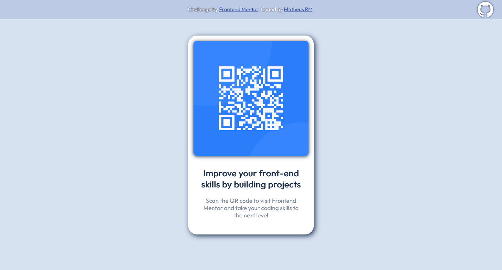

# Frontend Mentor - QR code component solution

This is a solution to the [QR code component challenge on Frontend Mentor](https://www.frontendmentor.io/challenges/qr-code-component-iux_sIO_H). Frontend Mentor challenges help you improve your coding skills by building realistic projects. 

## Table of contents

- [Overview](#overview)
  - [Screenshot](#screenshot)
  - [Links](#links)
- [My process](#my-process)
  - [Built with](#built-with)
  - [What I learned](#what-i-learned)
  - [Continued development](#continued-development)
  - [Useful resources](#useful-resources)
- [Author](#author)

## Overview

### Screenshot



### Links

- Solution URL: [Add solution URL here](https://github.com/Matheus-RM/QR-code-page)
- Live Site URL: [Add live site URL here](https://your-live-site-url.com)

## My process

### Built with

- HTML and CSS

### What I learned

Initially I thought that it would be difficult to set the github icon in the right place, but I found this to be quite easy, so I am proud of these lines.

```css
.github-link {
	...
	position: absolute;
	right: 25px;
	top: 5px;
  ...
}
```

### Continued development

In my next projects I would like to improve some animations and hover effects, and also learn more about responsive pages.

### Useful resources

- [MDN web docs](https://developer.mozilla.org/en-US/docs/Web/Tutorials) - These tutorials have really helped me with the basics, and I think they're a great learning resource.

## Author

- Frontend Mentor - [@Matheus-RM](https://www.frontendmentor.io/profile/Matheus-RM)
